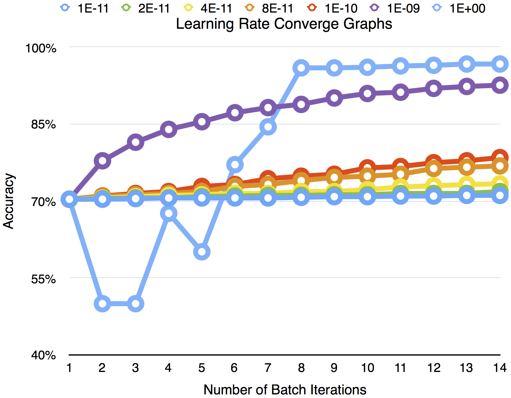
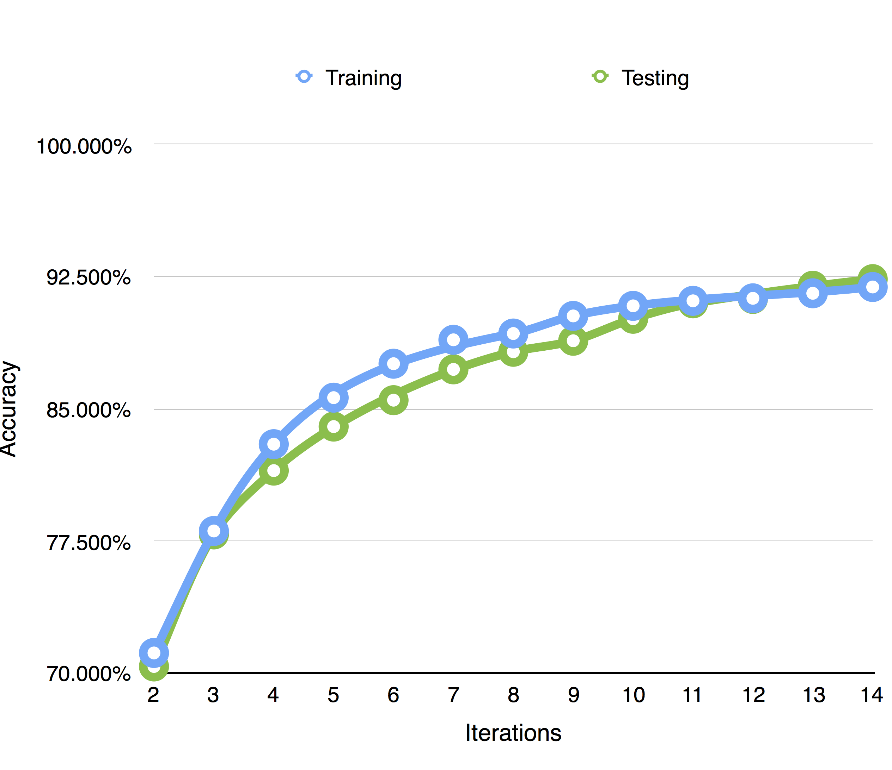
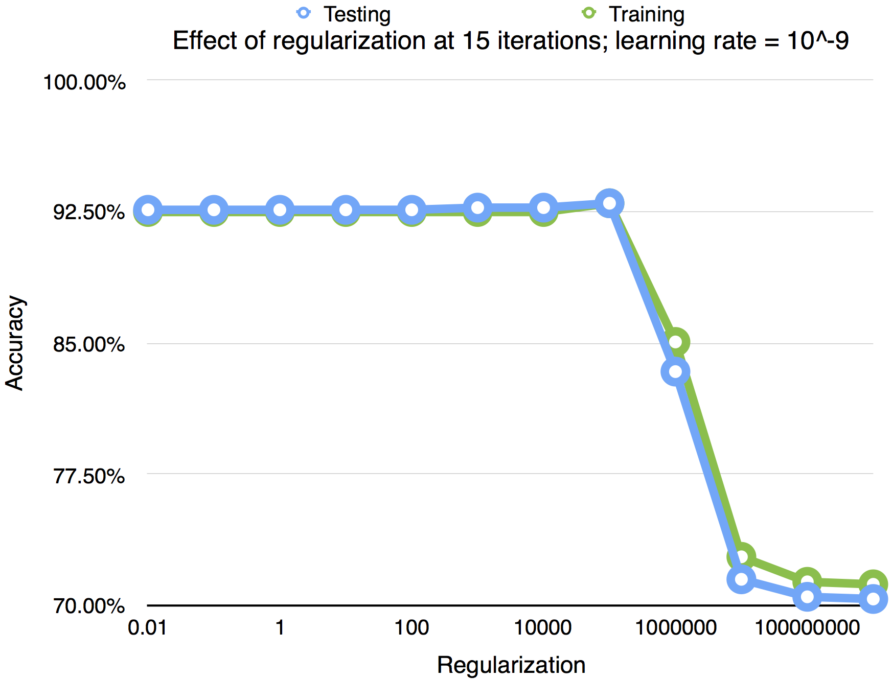

Machine Learning Assignment 2  
Andy Chase  
Brandon Edwards  
Daniel Kirkpatrick  

April 17th 2015

## Question 1

For most of the assignment 15 fixed iterations was used. Some parts were also tested with 300 and 1,000 iterations. Different learning values produce difference convergence graphs. 10^-9 produced a smooth but quickly climbing convergence graph.

## Question 2

They are very similar however the training data beats the test data until close to the end.

\pagebreak

## Question 3

	def g(weight, data):
	        return 1.0 / (1.0 + e^(-weight.transpose().dot(data)))

	def batch_learn(input_data, answers, learning_rate, iterations, regularization):
	    for each iteration:
	        accumulate = [0... input_data_length]
	        for answer, data in answers, input_data:
	            prediction = g(weight, data)
	            error = answer - prediction
	            accumulate += (error * data) + weight.dot(regularization)
	        weight += accumulate * learning_rate
	    return weight

## Question 4

The regularization didn't have huge impact on accuacy, there was a small spike before a massive falloff.

